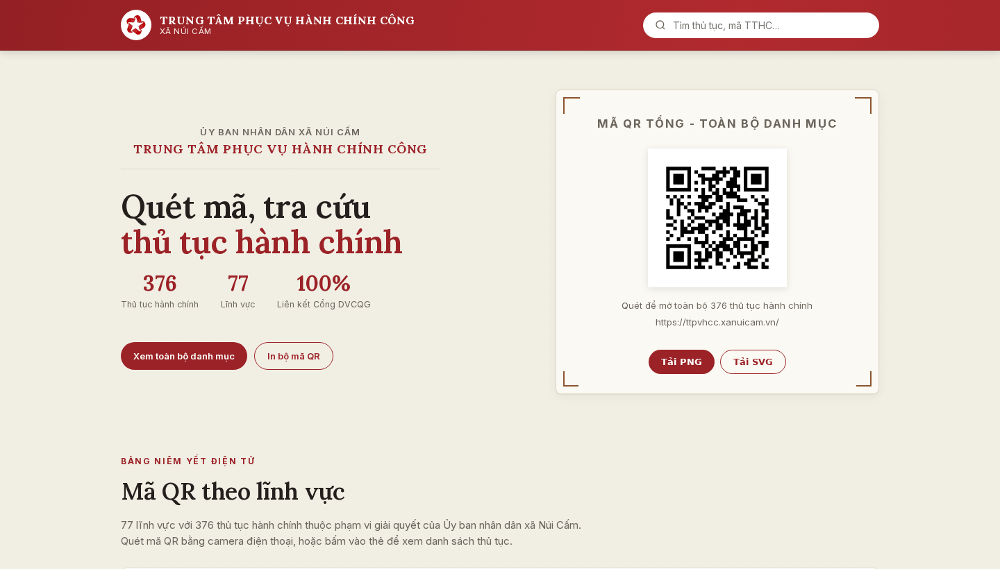
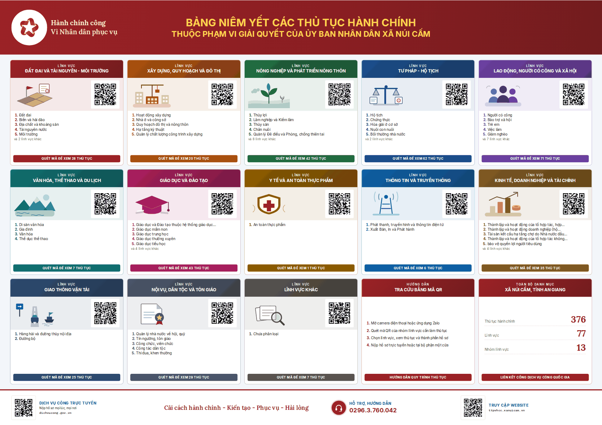
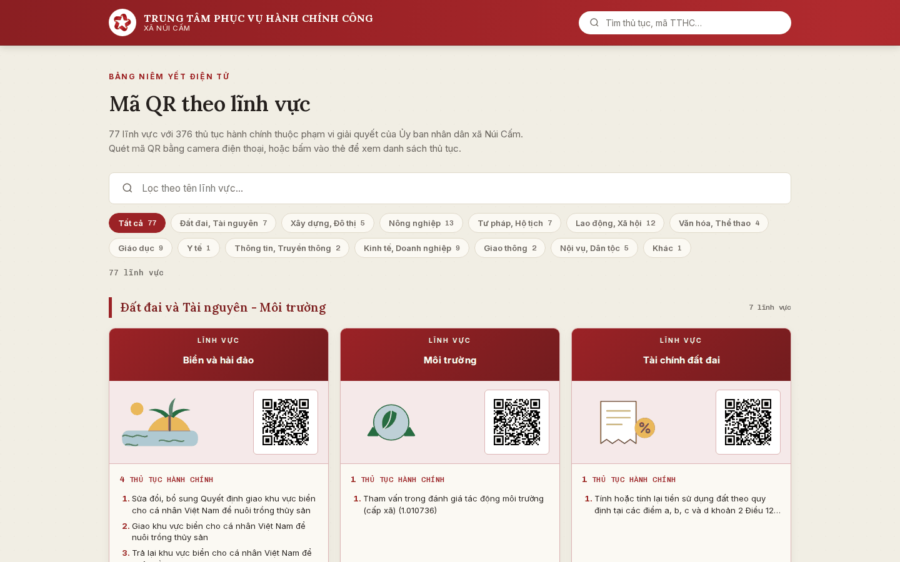
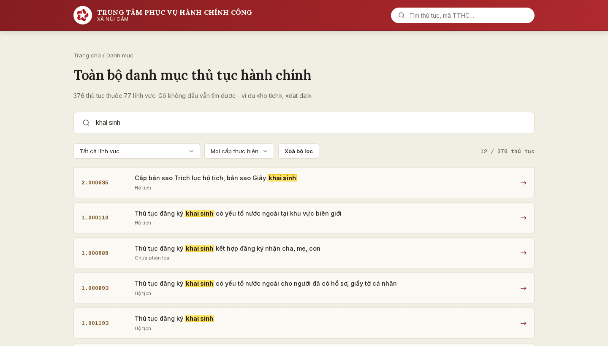
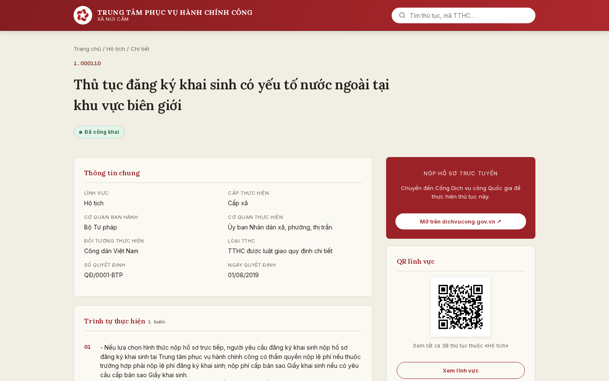
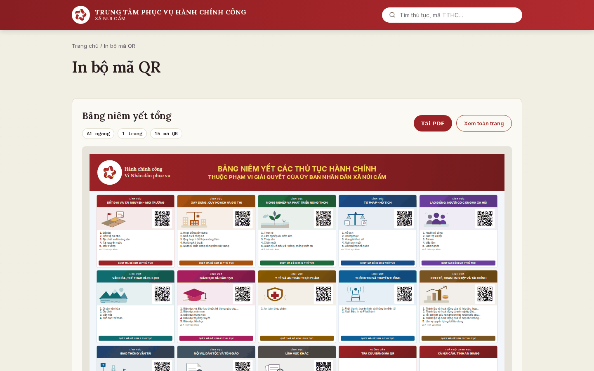
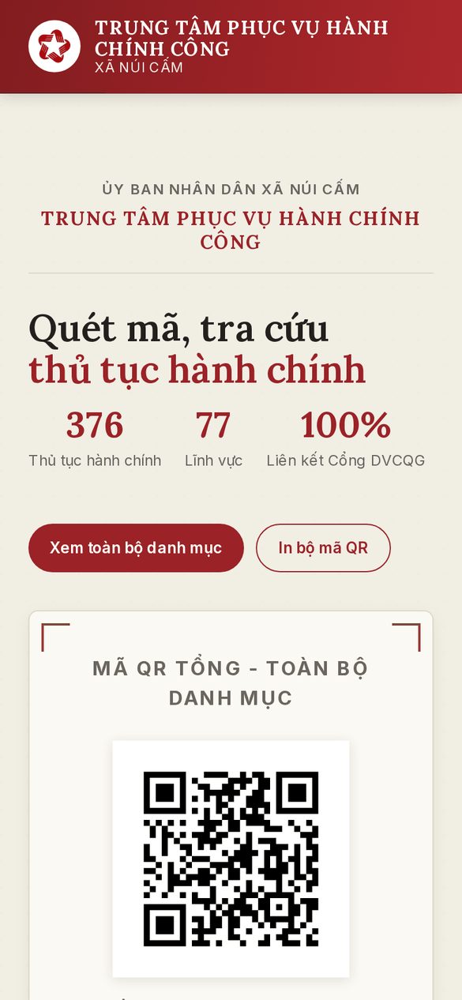
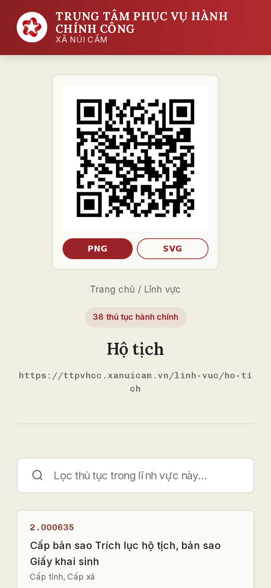

# ubnd-ttpvhcc-qr

**Hệ thống tra cứu thủ tục hành chính qua mã QR** - Trung tâm Phục vụ Hành chính công
xã Núi Cấm, tỉnh An Giang.

🌐 **https://ttpvhcc.xanuicam.vn**

[](https://github.com/dieuhanhcongviecxanuicam/ubnd-ttpvhcc-qr/actions/workflows/ci.yml)
[](https://github.com/dieuhanhcongviecxanuicam/ubnd-ttpvhcc-qr/actions/workflows/deploy.yml)
[](https://github.com/dieuhanhcongviecxanuicam/ubnd-ttpvhcc-qr/actions/workflows/codeql.yml)
[](https://github.com/dieuhanhcongviecxanuicam/ubnd-ttpvhcc-qr/actions/workflows/canh-san-xuat.yml)

Người dân quét mã QR dán tại quầy một cửa để mở ngay danh sách thủ tục của đúng
lĩnh vực cần làm, xem trình tự, hồ sơ, lệ phí, căn cứ pháp lý, rồi chuyển thẳng
sang Cổng Dịch vụ công Quốc gia để nộp trực tuyến. Cán bộ tải về bảng niêm yết
khổ A1, tờ niêm yết A4 theo nhóm và tem mã QR dựng sẵn thành PDF để in.



| **376** thủ tục hành chính | **77** lĩnh vực | **13** nhóm lĩnh vực | **92** mã QR | **3** bản in PDF |
|:---:|:---:|:---:|:---:|:---:|

---

## Mục lục

1. [Tính năng](#1-tính-năng)
2. [Giao diện](#2-giao-diện)
3. [Trạng thái hiện tại](#3-trạng-thái-hiện-tại)
4. [Bắt đầu nhanh](#4-bắt-đầu-nhanh)
5. [Cấu trúc dự án](#5-cấu-trúc-dự-án)
6. [Cập nhật danh mục thủ tục](#6-cập-nhật-danh-mục-thủ-tục)
7. [Lệnh có sẵn](#7-lệnh-có-sẵn)
8. [Kiểm soát chất lượng](#8-kiểm-soát-chất-lượng)
9. [Hạ tầng và bảo mật](#9-hạ-tầng-và-bảo-mật)
10. [Ghi chú kỹ thuật](#10-ghi-chú-kỹ-thuật)
11. [Tài liệu](#11-tài-liệu)
12. [Giấy phép](#12-giấy-phép)

---

## 1. Tính năng

### Cho người dân

- **Quét mã QR là tới đúng chỗ.** Mỗi lĩnh vực và mỗi nhóm lĩnh vực có mã QR
  riêng, dẫn thẳng tới danh sách thủ tục tương ứng; mã QR tổng mở toàn bộ danh mục.
- **Tra cứu không dấu.** Gõ "ho tich", "dat dai" vẫn ra kết quả; tìm theo tên, mã
  thủ tục hoặc từ khoá, lọc theo lĩnh vực và cấp thực hiện, tô sáng phần khớp.
- **Chi tiết đầy đủ từng thủ tục:** trình tự thực hiện; cách thức nộp kèm thời
  gian giải quyết, phí và lệ phí; thành phần hồ sơ; kết quả; căn cứ pháp lý; yêu cầu,
  điều kiện; cơ quan thực hiện và địa chỉ tiếp nhận hồ sơ.
- **Nộp trực tuyến một chạm** - nút chuyển sang đúng thủ tục trên Cổng Dịch vụ công
  Quốc gia.
- **Nhanh trên điện thoại, mạng yếu.** Toàn bộ hơn 470 trang dựng sẵn lúc build,
  36-204 KB mỗi trang, cache tại biên Cloudflare.
- **Thêm được vào màn hình chính** như một ứng dụng (PWA manifest).
- **Đạt chuẩn trợ năng WCAG 2.1 AA** - 0 vi phạm, có CI canh giữ.

### Cho cán bộ một cửa

- **Trang [In bộ mã QR](https://ttpvhcc.xanuicam.vn/in-ma-qr)** với ba bản in dựng
  sẵn thành PDF vector ở mỗi lần triển khai:

  | Bản in | Khổ | Số trang | Dùng để |
  |---|---|---|---|
  | Bảng niêm yết tổng | A1 ngang (phóng A0 không vỡ nét) | 1 | Treo tại sảnh |
  | Tờ niêm yết theo nhóm | A4 dọc | 13 | Dán tại quầy phụ trách từng nhóm |
  | Tem mã QR cỡ lớn | A4 dọc | 91 | Mỗi mã một tờ, chia về các quầy |

- **Tải từng mã QR** dạng PNG hoặc SVG ngay trên trang chủ và trang lĩnh vực.
- **Cập nhật dữ liệu không cần sửa mã nguồn** - đặt file Excel mới, chạy script,
  mở pull request; số liệu, trang, mã QR và bản in tự sinh lại.

## 2. Giao diện

Ảnh chụp từ site thật ngày 17/09/2026.

**Bảng niêm yết tổng khổ A1** - nguồn dựng bản PDF in treo tại sảnh:



<table>
  <tr>
    <td width="50%"><b>Mã QR theo lĩnh vực</b> - lọc theo tên, chia theo 13 nhóm<br><br></td>
    <td width="50%"><b>Tra cứu toàn bộ danh mục</b> - tìm không dấu, tô sáng phần khớp<br><br></td>
  </tr>
  <tr>
    <td width="50%"><b>Chi tiết thủ tục</b> - thông tin chung, trình tự, nút nộp trực tuyến<br><br></td>
    <td width="50%"><b>In bộ mã QR</b> - tải ba bản in PDF, xem trước toàn trang<br><br></td>
  </tr>
</table>

**Trên điện thoại** - bố cục người dân thực sự thấy sau khi quét mã tại quầy:

<p>
  
  &nbsp;&nbsp;
  
</p>

## 3. Trạng thái hiện tại

Cập nhật **17/09/2026**, phiên bản **1.22.0** - nhật ký đầy đủ ở [`CHANGELOG.md`](CHANGELOG.md).

| Hạng mục | Tình trạng |
|---|---|
| Vận hành | Đang chạy chính thức tại `ttpvhcc.xanuicam.vn` |
| Dữ liệu | 376 thủ tục, 77 lĩnh vực, xuất từ Cổng DVCQG ngày 06/08/2026 |
| Kiểm tra tự động | 45 test, 42 phép kiểm giao diện, 92 mã QR giải mã ngược - đều đạt |
| Trợ năng | 0 vi phạm WCAG 2.1 AA trên 8 loại trang |
| Hiệu năng (Lighthouse, site thật) | Trang chủ 92 · Chi tiết thủ tục 91 · Lĩnh vực 95 |
| Bảo mật | 0 cảnh báo CodeQL, 0 lỗ hổng npm, CSP không `unsafe-inline` |
| Việc chờ đơn vị | Xem [`docs/VIEC-CUA-DON-VI.md`](docs/VIEC-CUA-DON-VI.md) |

## 4. Bắt đầu nhanh

Cần Node.js 24 (xem `.nvmrc`) và Python 3 cho pipeline dữ liệu.

```bash
npm ci               # cài phụ thuộc
npm run dev          # máy chủ phát triển tại http://localhost:3000
```

Build bản triển khai:

```bash
npm run build        # xuất trang tĩnh vào out/ và chèn CSP
npm start            # xem thử bản đã build
```

Môi trường Python (một lần):

```bash
python3 -m venv .venv && source .venv/bin/activate
pip install -r scripts/requirements-dev.txt
```

> Hệ thống chạy trên tên miền riêng phục vụ từ gốc, không cần cấu hình thêm. Nếu
> muốn tạm triển khai lên GitHub Pages dạng đường dẫn con thì đặt
> `NEXT_PUBLIC_BASE_PATH=/ubnd-ttpvhcc-qr` khi build.

## 5. Cấu trúc dự án

```
ubnd-ttpvhcc-qr/
├── data/                        # Dữ liệu JSON - đọc lúc build, không gửi xuống trình duyệt
│   ├── tthc.json                #   376 TTHC kèm các bảng con (5,3 MB)
│   ├── linh-vuc.json            #   77 lĩnh vực: tên, slug, danh sách mã TTHC
│   ├── nhom-linh-vuc.json       #   13 nhóm và cách xếp 77 lĩnh vực vào nhóm
│   ├── meta.json                #   Số liệu tổng hợp hiển thị trên site
│   └── source/                  #   File Excel nguồn (không đưa lên Git)
├── brand/                       # logo-ttpvhcc.png - file gốc duy nhất của bộ nhận diện
├── public/
│   ├── CNAME                    # Tên miền riêng cho GitHub Pages
│   ├── .well-known/             # security.txt (RFC 9116) - kênh báo lỗ hổng
│   ├── brand/                   # Logo, favicon, icon PWA sinh từ file gốc
│   ├── minh-hoa/                # 33 hình SVG minh hoạ lĩnh vực
│   └── qr/                      # 92 mã QR × PNG + SVG: 1 tổng, 13 nhóm, 77 lĩnh vực,
│                                #   1 Cổng Dịch vụ công
├── src/
│   ├── app/                     # Route (App Router)
│   │   ├── page.tsx             #   /                     trang chủ, QR tổng, lưới QR lĩnh vực
│   │   ├── danh-muc/            #   /danh-muc             tra cứu toàn bộ danh mục
│   │   ├── nhom/[id]/           #   /nhom/<id>            13 trang - ĐÍCH CỦA MÃ QR NHÓM
│   │   ├── linh-vuc/[slug]/     #   /linh-vuc/<slug>      77 trang - ĐÍCH CỦA MÃ QR LĨNH VỰC
│   │   ├── tthc/[ma]/           #   /tthc/<mã>            376 trang chi tiết
│   │   ├── in-ma-qr/            #   /in-ma-qr             tải 3 bản in + 3 trang nguồn dựng PDF
│   │   └── globals.css          #   Hệ thống thiết kế "Dấu son & Mã QR"
│   ├── components/              # Thành phần giao diện; ban-in/ chứa bố cục các bản in
│   ├── fonts/                   # Lora, Inter, Chivo Mono tự host - mỗi họ một file
│   └── lib/                     # Truy xuất dữ liệu, cấu hình site, khai báo bản in
├── scripts/
│   ├── trich-xuat-du-lieu.py    # Excel → data/*.json
│   ├── tao-ma-qr.py             # data → public/qr/*
│   ├── dung-ban-in.ts           # out/ → 3 tệp PDF bản in (Chromium)
│   ├── them-csp.mjs             # Sinh CSP băm SHA-256 sau mỗi lần build
│   ├── kiem-tra-*.{mjs,py}      # Các bước kiểm chứng - xem mục 8
│   ├── cau-hinh-cloudflare.py   # Cache Rule, xoá cache khi triển khai
│   └── bao-ve-cloudflare.py     # WAF, giới hạn tần suất, chế độ chống tấn công
├── tests/                       # Test bằng bộ chạy có sẵn của Node
├── docs/                        # Vận hành, bảo mật, hiệu năng, việc của đơn vị, ảnh giao diện
└── .github/workflows/           # CI, triển khai, CodeQL, canh sản xuất, chống tấn công
```

## 6. Cập nhật danh mục thủ tục

Nhánh `main` được bảo vệ - mọi thay đổi đi qua pull request.

```bash
git switch main && git pull && git switch -c cap-nhat-danh-muc-tthc
# Đặt file Excel mới vào data/source/
python3 scripts/trich-xuat-du-lieu.py        # sinh lại data/*.json
python3 scripts/tao-ma-qr.py                 # sinh lại toàn bộ mã QR
python3 scripts/kiem-tra-ma-qr.py            # xác nhận mã QR trỏ đúng
# Thêm mục vào CHANGELOG.md, nâng "version" trong package.json
git add data public/qr CHANGELOG.md package.json
git commit -m "Cập nhật danh mục TTHC theo Quyết định số ..."
git push -u origin cap-nhat-danh-muc-tthc && gh pr create --fill
```

Khi CI xanh, hợp nhất pull request - hệ thống tự triển khai, dựng lại ba bản in
PDF và xoá cache Cloudflare. **Nếu danh sách lĩnh vực thay đổi, phải in và dán lại
mã QR** tại quầy tương ứng. Hướng dẫn chi tiết: [`docs/VAN-HANH.md`](docs/VAN-HANH.md).

**Đổi tên miền:** địa chỉ đích được nhúng cứng vào ảnh QR, nên phải sinh lại toàn
bộ mã với `--base-url https://ten-mien-moi`, sửa `public/CNAME` và `SITE_ORIGIN`
trong `src/lib/site-config.ts`, rồi in lại. Xem `docs/VAN-HANH.md` mục 3.

## 7. Lệnh có sẵn

| Lệnh | Tác dụng |
|---|---|
| `npm run dev` | Máy chủ phát triển |
| `npm run build` | Xuất trang tĩnh vào `out/` và chèn CSP |
| `npm start` | Xem thử bản đã build |
| `npm run kiem-tra` | Typecheck, lint và test - chạy trước mỗi lần đẩy mã |
| `npm run kiem-tra-csp` | Kiểm chứng Content-Security-Policy của bản build |
| `npm run kiem-tra-tro-nang` | axe-core trên bản build, chặn hồi quy WCAG 2.1 AA |
| `npm run kiem-tra-giao-dien` | 42 phép so bằng cho các chi tiết giao diện dễ hỏng âm thầm |
| `npm run dung-ban-in` | Dựng ba bản in PDF và ảnh xem trước từ `out/` |
| `npm run kiem-tra-san-xuat` | Đối chiếu nội dung site thật với bản build |
| `npm run kiem-tra-phien-ban` | Đối chiếu `package.json` với `CHANGELOG.md` |
| `npm run du-lieu:lam-moi` | Trích xuất lại dữ liệu và sinh lại mã QR |
| `npm run kiem-tra-qr` | Giải mã ngược mã QR, đối chiếu với route thật |
| `npm run kiem-tra-bo-chu` | Đối chiếu bộ chữ tự host với ký tự trong dữ liệu |
| `python3 scripts/kiem-tra-pipeline.py` | Chạy khứ hồi pipeline trích xuất dữ liệu |
| `python3 scripts/tao-bo-nhan-dien.py` | Sinh lại logo, favicon, icon PWA từ file gốc |

## 8. Kiểm soát chất lượng

Mỗi pull request phải qua **ba kiểm tra bắt buộc** trước khi hợp nhất:

| Kiểm tra | Nội dung |
|---|---|
| `Typecheck, lint, test, build` | Đối chiếu phiên bản, chặn đường dẫn kiểu Windows, TypeScript, ESLint, 45 test, build, CNAME, CSP, trợ năng WCAG 2.1 AA, 42 phép kiểm giao diện, dựng thử ba bản in PDF, `npm audit` |
| `Đối chiếu mã QR với route` | Giải mã ngược 92 mã QR, đối chiếu bộ chữ, khứ hồi pipeline dữ liệu, `pip-audit` |
| `Phân tích JavaScript/TypeScript` | CodeQL |

Chạy theo lịch:

| Workflow | Khi nào | Việc |
|---|---|---|
| Canh nội dung trên sản xuất | 09:00 hằng ngày | Phát hiện Cloudflare tự sửa `robots.txt`, `security.txt`, `sitemap.xml` hoặc chèn script vào trang |
| Quét mã CodeQL | Hằng tuần | Quét lại toàn bộ mã nguồn |
| Chế độ chống tấn công | Bấm tay | Bật/tắt trang xác minh khi bị tấn công - chạy được từ trình duyệt điện thoại |

## 9. Hạ tầng và bảo mật

| Thành phần | Cấu hình |
|---|---|
| Hosting | GitHub Pages, triển khai bằng GitHub Actions khi hợp nhất vào `main` |
| Tên miền | `ttpvhcc.xanuicam.vn` - `CNAME` tới `dieuhanhcongviecxanuicam.github.io` |
| CDN và DNS | Cloudflare, **bật proxy**; trang HTML và tài nguyên tĩnh cache tại biên |
| HTTPS | Chứng chỉ Cloudflare Universal SSL, HSTS `max-age` 1 năm kèm `preload` |
| CSP | Sinh lúc build, băm SHA-256 từng script nội tuyến, không `unsafe-inline` |
| Header biên | `Cache-Control: no-transform` - chặn Cloudflare chèn script làm hỏng CSP |
| Chống tấn công | Luật WAF chặn đường dẫn quét lỗ hổng và tệp bí mật, giới hạn tần suất theo IP, Browser Integrity Check, Bot Fight Mode |
| Chuỗi cung ứng | GitHub Action ghim theo commit SHA, Dependabot, secret scanning, CodeQL |

> Proxy Cloudflare đang bật nên GitHub không tự cấp chứng chỉ cho tên miền - đây
> là cấu hình đúng, không phải lỗi. Đừng bật "Enforce HTTPS" phía GitHub.

Chi tiết cấu hình và quy trình rà soát định kỳ: [`docs/BAO-MAT.md`](docs/BAO-MAT.md).
Báo lỗ hổng: [`SECURITY.md`](SECURITY.md).

## 10. Ghi chú kỹ thuật

**Vì sao pre-render toàn bộ.** Bản MVP đầu tải cả `tthc.json` (5,3 MB) trên mọi
trang rồi mới dựng nội dung bằng JavaScript. Nay dữ liệu chỉ được đọc lúc build;
trình duyệt nhận HTML đã có sẵn nội dung. Phần lớn người dùng quét QR bằng điện
thoại dùng mạng di động.

**Vì sao cần giải mã ngược mã QR.** Mã QR một khi đã in và dán tại quầy thì không
sửa được. `kiem-tra-ma-qr.py` giải mã từng ảnh và đối chiếu với đường dẫn website
thực sự phục vụ, chạy trong CI mỗi lần đẩy mã. Dùng **zxing-cpp** chứ không dùng
OpenCV: OpenCV đọc hụt mã QR từ version 5 trở lên và báo lỗi giả.

**URL không có dấu "/" ở cuối.** Next xuất `/<route>.html` và GitHub Pages phục vụ
tệp đó cho đường dẫn không đuôi, kể cả đường dẫn chứa dấu chấm như `/tthc/1.000288`.
Không đổi cấu hình này - mọi mã QR đã in phụ thuộc vào nó.

**Font tự host, mỗi họ một file.** Lora, Inter, Chivo Mono phủ trọn tiếng Việt, sinh
bằng `scripts/tao-bo-chu.py`. Không dùng `next/font/google` vì nó cắt bộ chữ theo
`unicode-range`, khiến dấu tiếng Việt nằm ở file khác với chữ cái không dấu - đổi
sang tự host giảm 43-55% thời gian Style & Layout.

**Mã QR đen tuyền** trên nền trắng: tương phản cao nhất, máy quét đọc chắc hơn kể cả
khi bản in phai màu hoặc quầy thiếu sáng.

**Nhận diện thương hiệu.** Logo, favicon và icon PWA sinh từ một file gốc
`brand/logo-ttpvhcc.png` bằng `scripts/tao-bo-nhan-dien.py`.

**Test.** Bộ chạy test có sẵn của Node, không thêm framework. Nhóm bất biến dữ liệu
trong `tests/du-lieu.test.ts` đối chiếu số thủ tục khai báo với số mã giải được -
đúng lớp lỗi từng lọt ra production khi trang lĩnh vực ghi "7 thủ tục" nhưng danh
sách trống.

## 11. Tài liệu

| Tài liệu | Nội dung |
|---|---|
| [`docs/VIEC-CUA-DON-VI.md`](docs/VIEC-CUA-DON-VI.md) | Việc người vận hành cần tự làm hoặc tự quyết |
| [`docs/VAN-HANH.md`](docs/VAN-HANH.md) | Cập nhật dữ liệu, in mã QR, đổi tên miền, Cloudflare, sự cố |
| [`docs/BAO-MAT.md`](docs/BAO-MAT.md) | Kiến trúc phòng thủ, CSP, header, rà soát định kỳ, chống DDoS |
| [`docs/HIEU-NANG.md`](docs/HIEU-NANG.md) | Số liệu Lighthouse cơ sở và các hướng tối ưu đã đo |
| [`CONTRIBUTING.md`](CONTRIBUTING.md) | Quy trình đóng góp, kiểm tra bắt buộc, quy ước phiên bản |
| [`CHANGELOG.md`](CHANGELOG.md) | Nhật ký thay đổi từng phiên bản |
| [`SECURITY.md`](SECURITY.md) | Cách báo lỗ hổng bảo mật |

**Nguồn dữ liệu:** [Cổng Dịch vụ công Quốc gia](https://dichvucong.gov.vn) - dữ liệu
thủ tục hành chính là thông tin công khai.

## 12. Giấy phép

[MIT](LICENSE) - mã nguồn. Dữ liệu thủ tục hành chính thuộc về cơ quan nhà nước có
thẩm quyền công bố.
